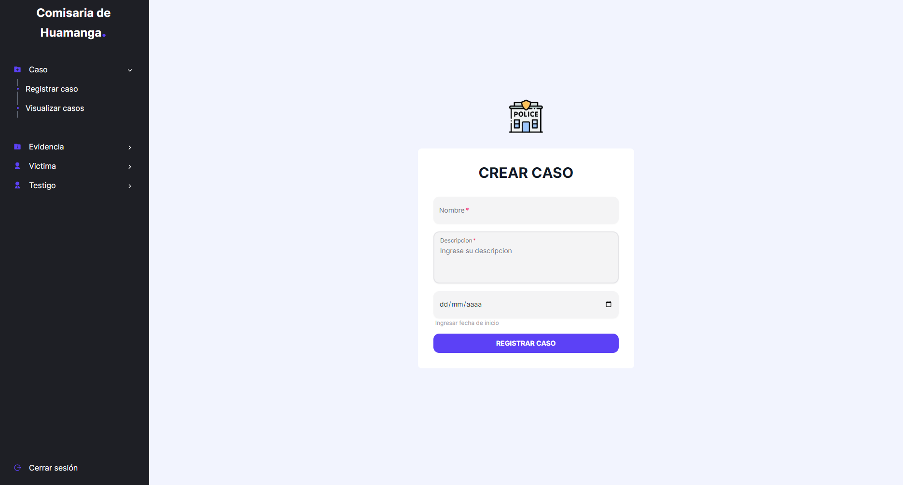

<h1 align="center">Bienvenido al Dashboard Commissar 👋</h1>
<p>
  
</p>

> Frontend de la zona administrativa de la comisaria

### ✨ [Demo](https://dashboard-commisary-next13.vercel.app/)



## Instalación

```sh
npm install
```

## Desarrollador

```sh
npm run dev
```

## Uso

```sh
npm run start
```

## Autor

👤 **Marcos Alanya Pacheco**

- Website: https://marcos-alanya-portafolio.vercel.app/
- Github: [@MarcosAlanya19](https://github.com/MarcosAlanya19)
- LinkedIn: [@marcosAlanya19](https://linkedin.com/in/marcosAlanya19)

## Show your support

Give a ⭐️ if this project helped you!

---

_This README was generated with ❤️ by [readme-md-generator](https://github.com/kefranabg/readme-md-generator)_
